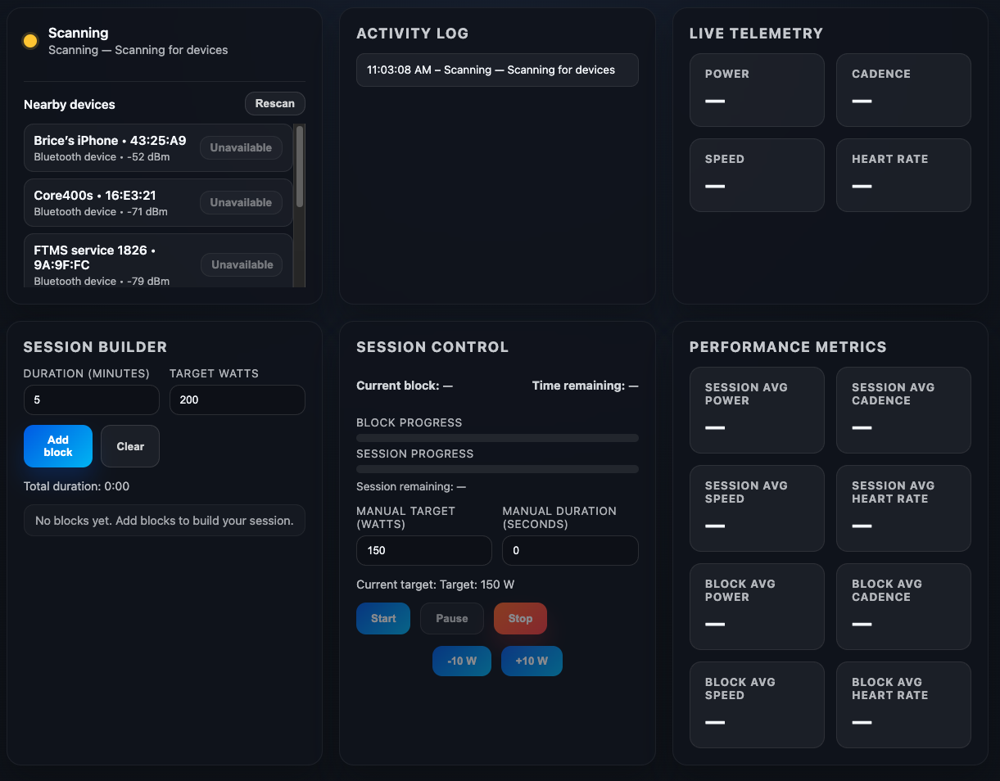

# Open Trainer

Minimalistic home trainer control app that connects to a Bluetooth FTMS home trainer (for example an Elite Suito) and drives it in ERG mode. The UI lets you:

- Discover nearby FTMS trainers (and other BLE devices) with live signal strength and connect/disconnect per device.
- Build structured workouts block-by-block (X minutes at Y watts) and reorder them with drag-and-drop before starting a session.
- Start an ERG session (manual or structured), pause/resume, and monitor block/session progress on dedicated cards.
- Stop the session at any time.
- Nudge the target watts up/down without restarting.
- Watch live telemetry for power, cadence, and speed alongside session/block averages.

> **Important:** This repository is a first draft. Code is untested, error handling is intentionally simple and the BLE stack relies on the experimental `@abandonware/noble` package. Use at your own risk and start with low watt targets when testing.

## Prerequisites

- Bluetooth Low Energy hardware (tested on Mac Mini M4).
- Permissions to use Bluetooth (grant the app access when macOS prompts).
- A home trainer OFC (tested on Elite Suito).
- [Node.js 20+](https://nodejs.org/en/download) installed (`brew install node` is the quickest path on macOS).

## Getting started

```bash
cd open-trainer
npm install
npm start
```

`npm start` builds the TypeScript sources, copies the static assets, and launches Electron. The renderer loads `src/renderer/index.html`, so any UI tweaks are hot-reloaded when you restart the app.

### Development mode

For iterative work with automatic compilation:

```bash
npm run dev
```

This runs TypeScript in watch mode, copies renderer assets on change, and relaunches Electron after the first build completes.

## Usage notes

1. **Connect:** Click **Rescan** (or wait a second after launch) to populate the _Nearby devices_ list, then use the **Connect** button next to your trainer. Non-trainer peripherals are shown as “Unavailable” for now.
2. **Build:** Create blocks in the Session Builder, drag them to adjust order, and review the total duration.
3. **Start:** Adjust the desired watts and optional duration (seconds). Press **Start** to send the request-control, target-power, and start commands.
4. **Control:** Use **Pause** / **Resume**, **Stop**, and **±10 W** nudges as needed during the workout.
5. **Review:** The Activity Log card records discovery, connection, and control events for quick troubleshooting.

Telemetry updates appear in the **Live Telemetry** card. All power values are capped between 0 W and 2500 W for safety.

## Known limitations

- No ANT+ FE‑C support—BLE FTMS only.
- Nearby discovery lists heart-rate monitors, but only FTMS trainers can be controlled for now.
- Tested on macOS 26.0.1 with Elite Suito 

Contributions, bug reports, and enhancements are welcome.