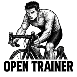

# Open Trainer

Open Trainer is a minimalistic home trainer control app that lets you connect to your home trainer (for example an Elite Suito) via Bluetooth FTMS and drives it in ERG mode. The UI lets you:

- Scan and connect nearby FTMS trainers, and other BLE devices (e.g. heart rate sensor).
- Build a structured workout block-by-block (X minutes at Y watts).
- Start an ERG session (from a structured workout or on the fly), increase/decrease target watts, pause/resume/stop workout
- Monitor block/session progress, and live telemetry for power, cadence, HR, and speed alongside session/block averages.

> **Important:** This repository is a first draft. Code is untested, error handling is intentionally simple and the BLE stack relies on the experimental `@abandonware/noble` package. Use at your own risk and start with low watt targets when testing.

## Prerequisites

- Bluetooth Low Energy hardware (tested on Mac Mini M4).
- Permissions to use Bluetooth (grant the app access when macOS prompts).
- A home trainer OFC (tested on Elite Suito).
- [Node.js 20+](https://nodejs.org/en/download) installed (`brew install node` is the quickest path on macOS).

## Install

```bash
git clone https://github.com/brice-olivier/open-trainer
cd open-trainer
npm install
npm start
```

## Known limitations

- No ANT+ FE‑C support—BLE FTMS only.
- Should work crossplatform and with all (recent?) home trainers using FTMS protocol (and as long as you keep its firmware updated), though it's only been tested on macOS 26.0.1 with an Elite Suito-T from ~2021 

## Todo
- Add workout export to .fit file.
- Add workout export directly to your Strava (automated?).
- Add support of non ERG modes (slope/level/resistance - might be better for sprints).
- Add zwift cog supports with virtual shifts.
- Enhance UI for ongoing session.
- Add a dedicated UI for workout builder which also lets you save / load workouts.
- App release rather than npm install.

Suggestions, contributions, bug reports, and enhancements are welcome.

Sportingly.

<p align="center">
  
</p>